# ダイアログの作成
まずは「ダイアログのUI」を作りましょう。新規`Eiga`ノードを作成してください。`eiga`ディレクトリを作り、そこに関連ノードはまとめておくことをおすすめします。

ここでは以下のようにします
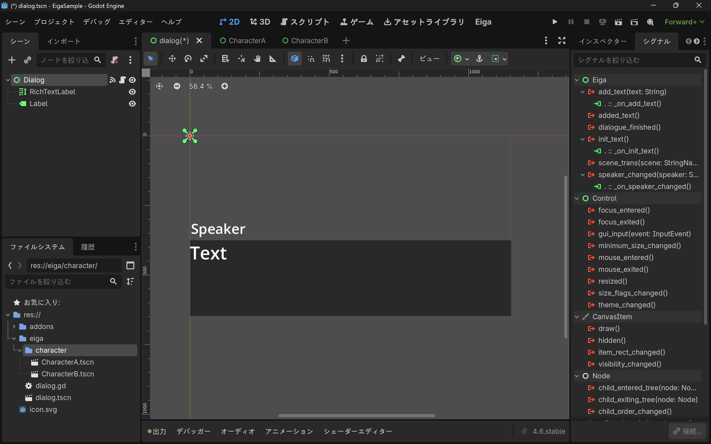

アタッチ(スクリプトの拡張)したスクリプトは以下です。

```gdscript
extends Eiga

@onready var text_label := $RichTextLabel
@onready var speaker_label = $Label

func _ready():
	run()

func _on_add_text(text):
	for t in text:
		text_label.text += t
		await get_tree().create_timer(0.1).timeout
	emit_added_text() # 必須！

func _on_init_text():
	text_label.text = ""

func _on_speaker_changed(speaker):
	speaker_label.text = speaker
```

# イベントの接続
`Eiga`ノードには以下のイベントがあります。

| イベント名 | 詳細 |
| ---- | ---- |
| `add_text(text: String)` | テキストボックスに追加される文字列が渡されます。**最後に`emit_added_text()`関数を呼んでください！** |
| `init_text()` | テキストボックスの初期化時に呼ばれます |
| `scene_trans` | `->`によって指定されたシーンが渡されます |
| `speaker_changed(speaker: String)` | 話者が渡されます |

# 話者を作る
それでは実際に会話を作っていきましょう。

まずは話者を作ります。
`EigaCharacter`ノードを継承したノードを作り、インスペクターの`Show Name`の所に実際に表示する話者名を入力します。ここで作成する`EigaCharacter`ノードのノード名は非常に重要ですので、しっかりとした名前を付けましょう。

ここでは以下のように`CharacterA`(`John`)、`CharacterB`(`Bob`)を作ります。
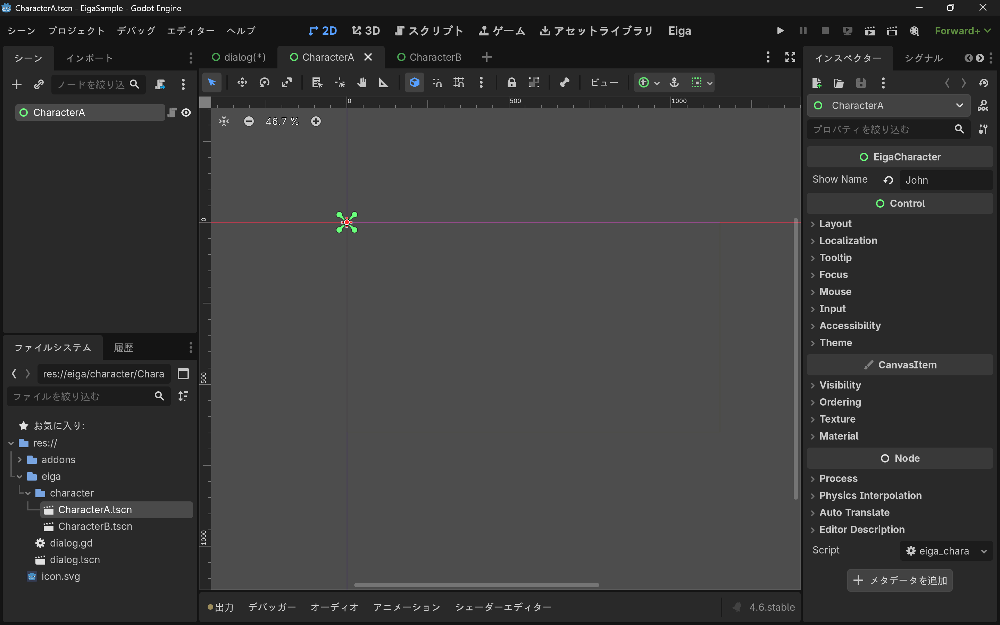
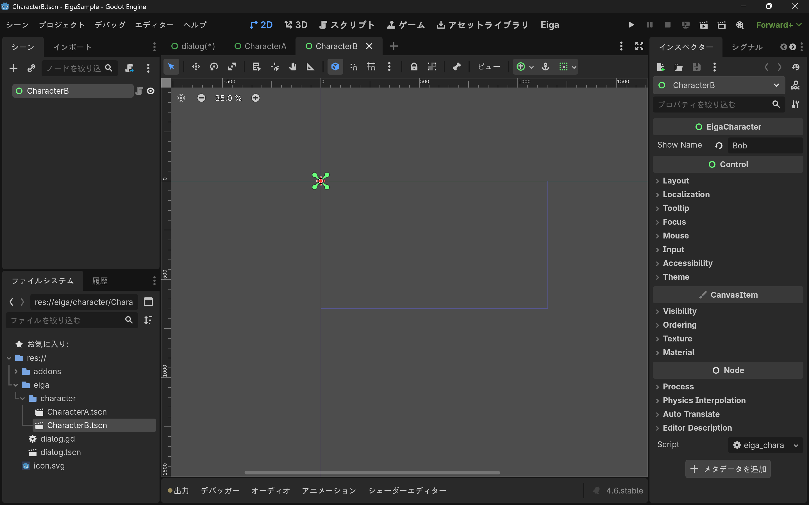

# 会話を作る
それでは実際に会話シーンを作っていきましょう。

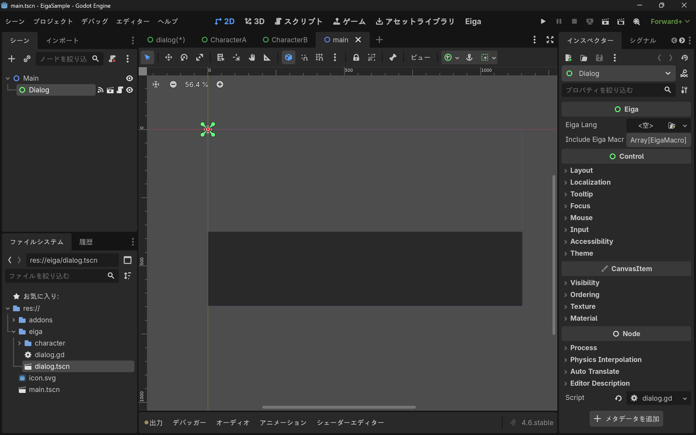
このように実際の会話シーンを作る時は`Eiga`ノードではなく、[ダイアログの作成](#ダイアログの作成)で作成した物をインスタンス化して使います。

次に[話者を作る](#話者を作る)で作成した`EigaCharacter`を **`Dialog`の子** に配置します。

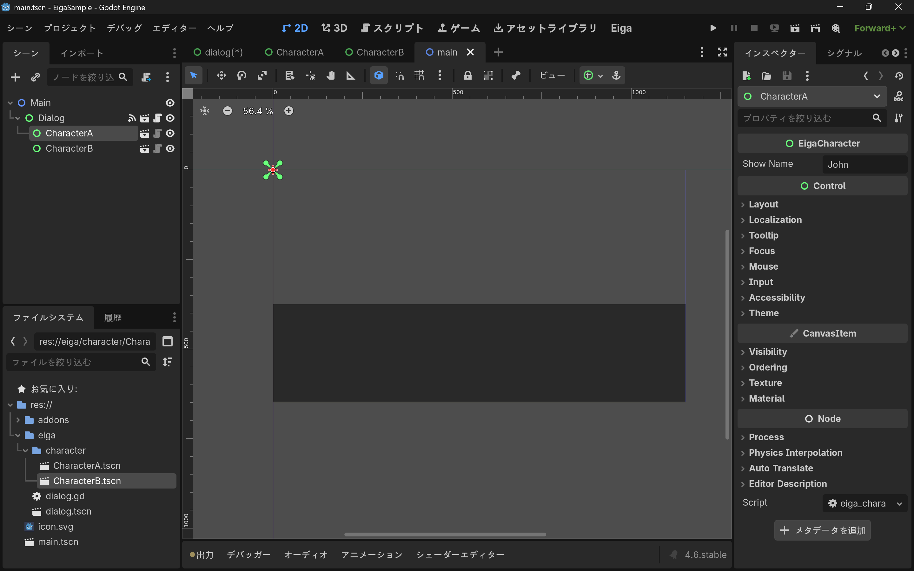

# EigaLangを書く
次はいよいよ`EigaLang`を書いていくことになります。

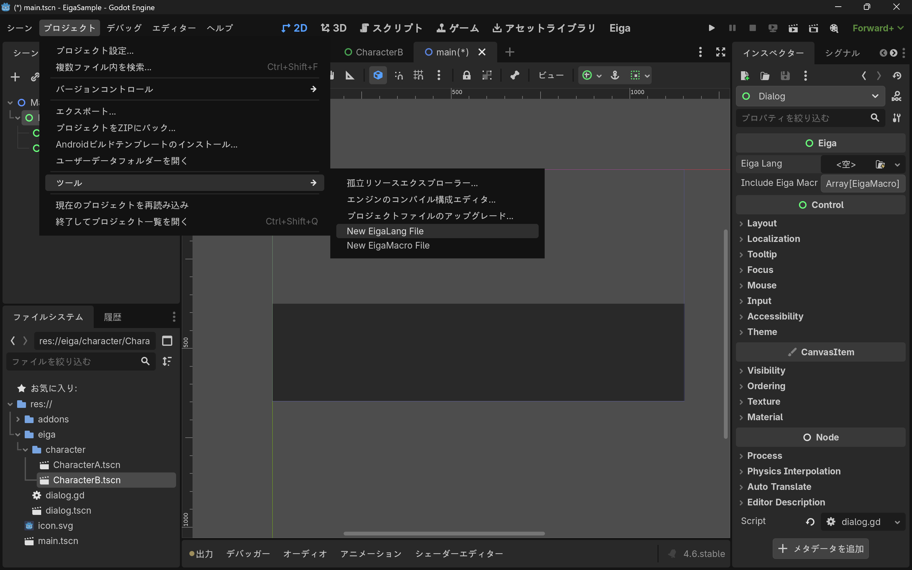
「プロジェクト」→「ツール」より「New EigaLang File」をクリックし、任意の場所に`EigaLang`のファイルを作成します(拡張子は`.eiga`です)。

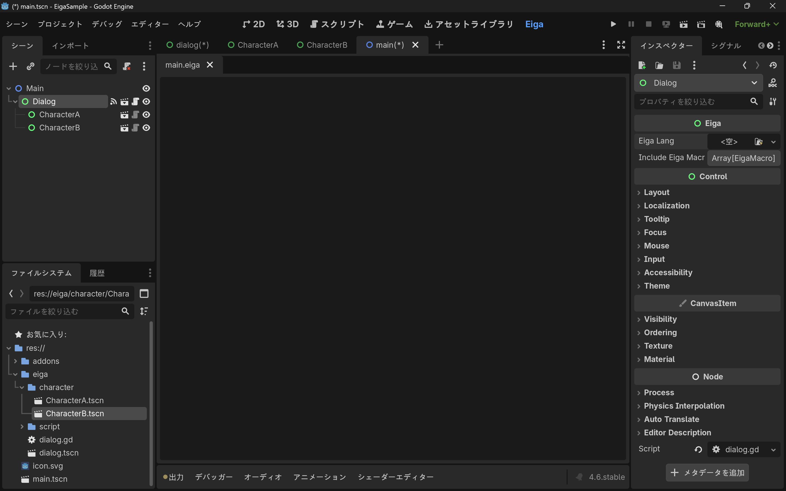
このようにエディターが開いたらokです！

今回は以下のように書こうと思います。

```:main.eiga
@CharacterA
テスト1

@CharacterB
テスト2[wait(1)].[wait(2.5)].[wait(3)].

@- # -とすると直前の話者を引き継ぎます。
テスト3
[pause()]
テスト4

@ # 何も指定しないと話者は""になります。
テスト5
テスト6
[pause()]
テスト7
```

書いて保存したら`EigaScript`ファイルをダイアログに指定します。

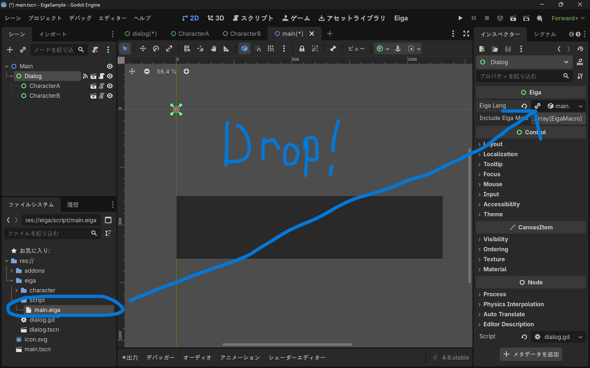

この状態でシーンを実行すると以下のようになります。

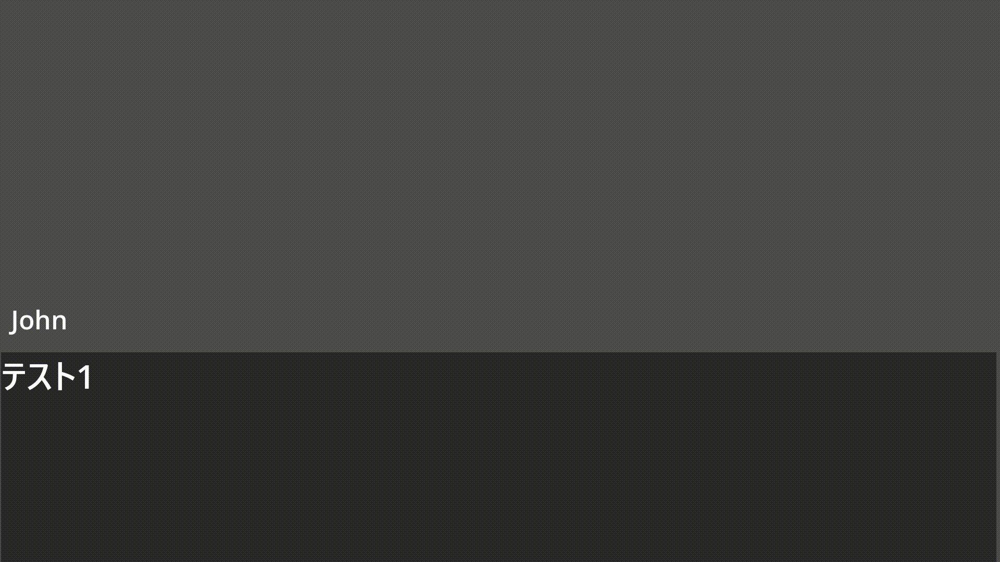

# 応用
`CharacterA`と`CharacterB`のスクリプトを拡張して、それぞれ以下のようにします。

```gdscript:character_a.gd
extends EigaCharacter

func move_x(dx: int) -> void:
	var t := create_tween()
	t.tween_property(self, "position:x", position.x + dx, 2.0)
	await t.finished
```

```gdscript:character_b
extends EigaCharacter

@onready var label := $Label

func move_y(dy: int, finished_text: String) -> void:
	var t := create_tween()
	t.tween_property(self, "position:y", position.y + dy, 2.0)
	await t.finished
	label.text = finished_text
```

追加で`Dialog`のスクリプトをさらに拡張します。

```gdscript:main_dialog.gd
extends "res://eiga/dialog.gd"

@onready var rect := $ColorRect
@onready var rotation_timer := $Timer

var tween: Tween

func rotation_rect(time: float) -> void:
	tween = create_tween()
	tween.tween_property(rect, "rotation_degrees", 360, 1.0)
	tween.tween_callback(
		func():
			rect.rotation_degrees = 0
	)
	tween.set_loops(-1)
	rotation_timer.wait_time = time
	rotation_timer.start()
	await rotation_timer.timeout
	rect.rotation_degrees = 0

func _on_timer_timeout():
	tween.kill()

func _on_scene_trans(scene):
	var t := create_tween()
	t.tween_property(self, "modulate:a", 0, 1.0)
	t.tween_callback(
		func():
			get_tree().change_scene_to_file(scene)
	)
```

その他`CharacterA`、`CharacterB`の両方に分かりやすくラベルを置いたり、回転用の`ColorRect`を置いたりします。
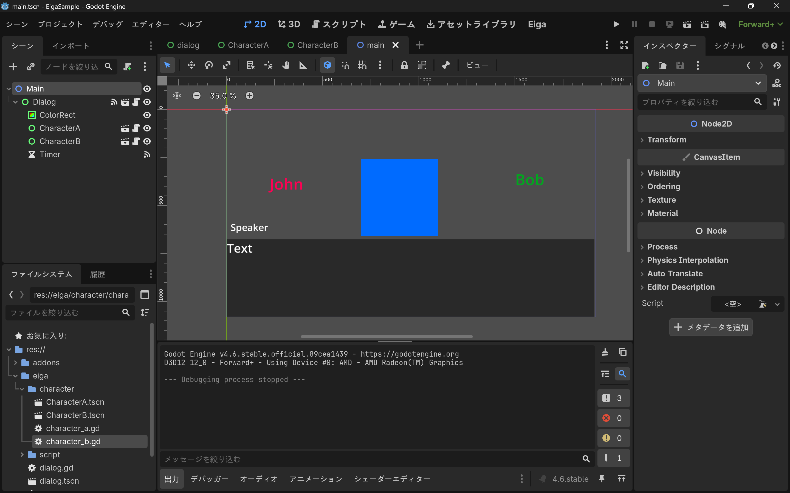

さらに、会話が終わったらシーン遷移するようにしましょう。遷移先の`next_scene.tscn`を作ります。

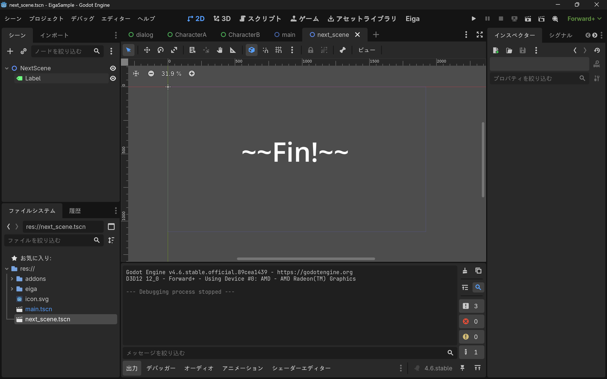

`EigaLang`は以下のように記述します。

```:main.eiga
@CharacterA
テスト1

@-
テスト2
[&call("rotation_rect", 5.5)]
[call("CharacterA.move_x", 900)]
テスト3

@CharacterB
テスト4
[&call("CharacterB.move_y", -300, "Moved!")]
[&call("CharacterA.move_x", -1000)]
テスト5

-> uid://cogw6uvkb8a4a # next_scene.tscnのUID (環境依存のため適宜変えてください！)
```

こうすると以下のようになります。

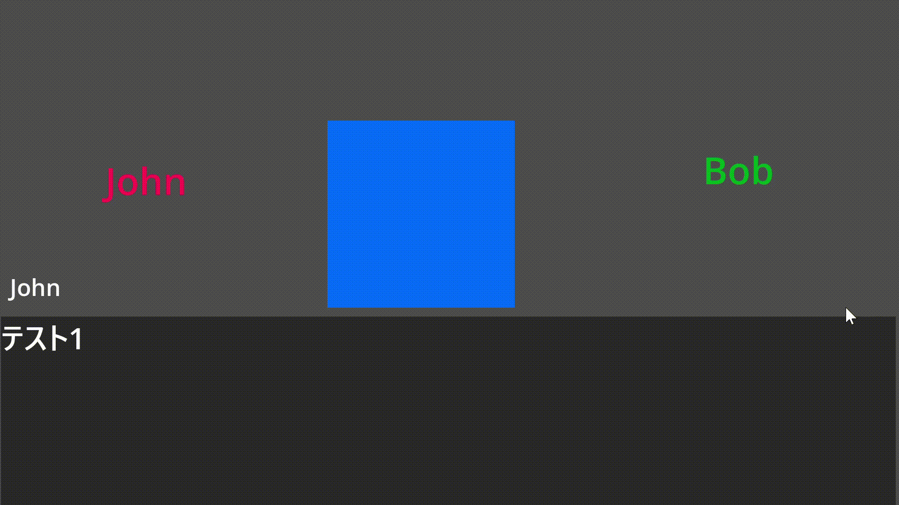