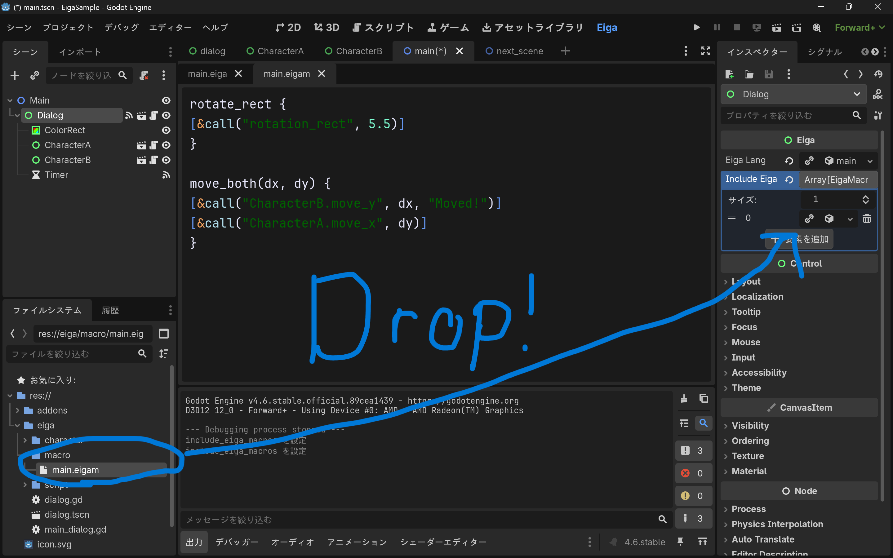

# マクロについて
`マクロ`とは **「頻繁に使う関数などを短いキーワードですぐ呼び出せる」** 機能です。
拡張子は`.eigam`です。

# マクロの文法
```sample.eigam
マクロ名 {
処理...
}

# 引数を指定することもできます
# $引数名で受け取ることが出来ます
マクロ名(arg1, arg2) {
[call("func1", $arg1, $arg2)]
}
```

なお、現時点ではマクロは **スクリプトのみ** に対応しています。つまり`@`や`->`を用いた構文はマクロとして認識されません。

# マクロの呼び出し
マクロを適用したい会話でインスペクターの`Include Eiga Macros`に`.eigam`ファイルを追加してください。汎用的な物は個別ではなく最初に`Eiga`を継承したシーンに追加することをおすすめします。


`<マクロ名>`とすることで該当のマクロを展開することが出来ます。

```
@CharacterA
テキスト
<マクロ名>
<マクロ名(arg1, arg2)>
```

# サンプル
[応用](./EXAMPLE.md#応用)のEigaLangにマクロを適用してみます。

```:main.eigam
rotate_rect {
[&call("rotation_rect", 5.5)]
}

move_both(dx, dy) {
[&call("CharacterB.move_y", $dx, "Moved!")]
[&call("CharacterA.move_x", $dy)]
}
```

このようにマクロを書き、以下のようにマクロを適用します。



EigaLangは以下のように書くことが出来ます。

```:main.eiga
@CharacterA
テスト1

@-
テスト2
<rotate_rect>
[call("CharacterA.move_x", 900)]
テスト3

@CharacterB
テスト4
<move_both(-300, -1000)>
テスト5

-> uid://cogw6uvkb8a4a # next_scene.tscnのUID (環境依存のため適宜変えてください！)
```
